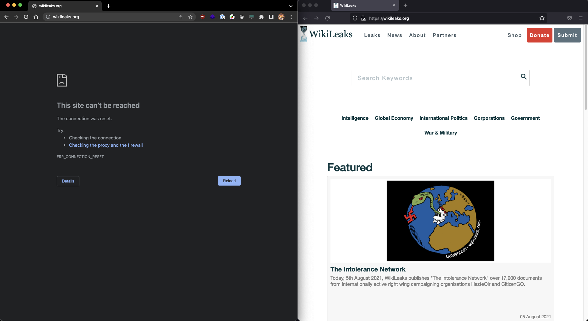
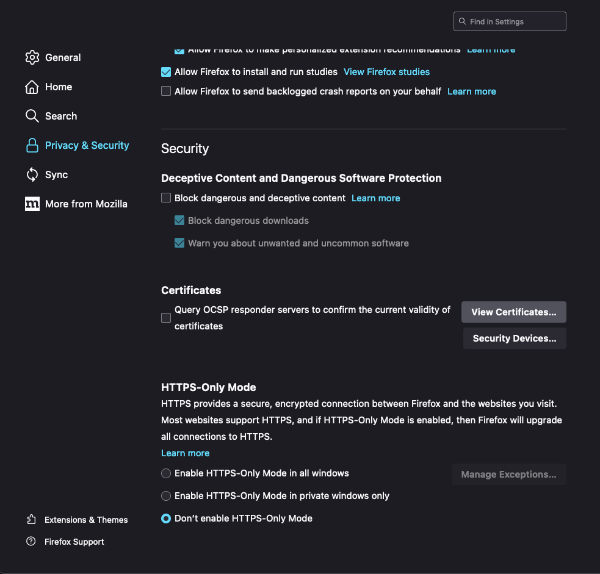
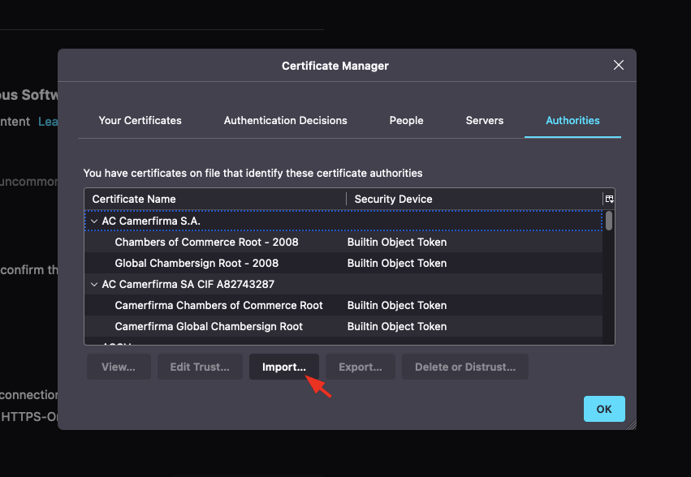
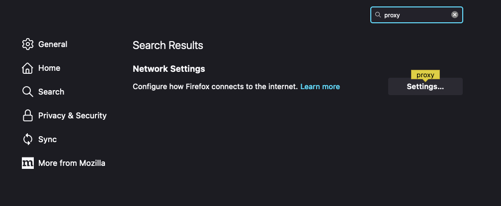
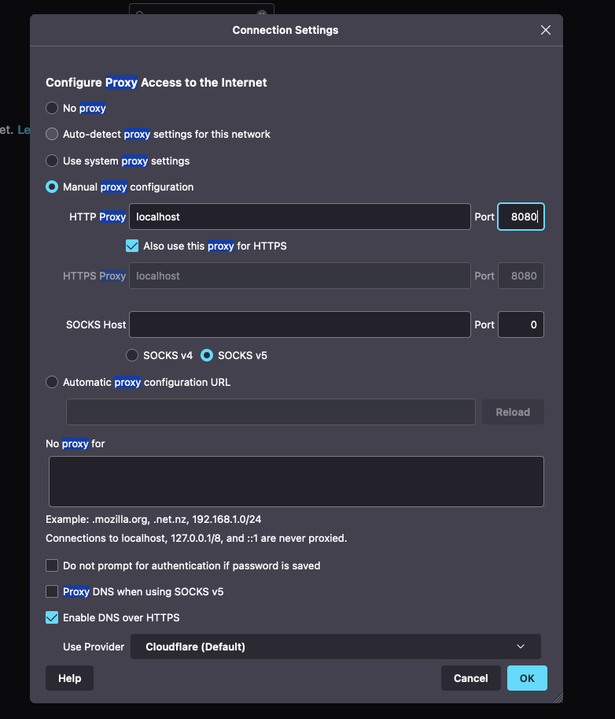
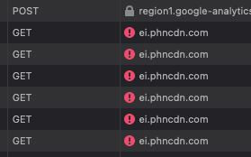

# sni-proxy

Bypass SNI-based censorship for sites that don't look at the Server Name Indication field in the TLS handshake. (Example list in [domains.yaml](./domains.yaml))

> Left: Chrome (regular connection)
>
> Right: Firefox (proxied connection)

# Usage

As always, start with cloning the repo locally and make sure you're in the root folder.

0. Make sure you're using a [DoH/DoT enabled DNS server](https://developers.cloudflare.com/1.1.1.1/encryption/dns-over-https/encrypted-dns-browsers/) for website lookups and not your ISP's DNS otherwise this entire thing won't even work. Cloudflare's 1.1.1.1 is pretty good.

1. Install [mitmproxy](https://mitmproxy.org/).

2. Install [python 3](https://www.python.org/downloads/)

3. Install the dependencies with pip `pip3 install -r requirements.txt`

To simply start the proxy: `mitmproxy --ssl-insecure -s addon.py -p 8080`

## Certificate

For testing, I recommend using a separate browser like Firefox which keeps its own proxy/certificate settings separate from the system unlike chrome. Trying to proxy everything that's going on in your computer can be a bit of a hassle for when the proxy goes down.

Add the mitmproxy root CA to Firefox by visiting http://mitm.it and downloading the cert `.pem` file.

> If the site tells you that your traffic isn't being routed through the proxy, make sure you're on the `http` version of the site and not `https`. And also that you have mitmproxy running lol.

Just select the downloaded file at this point.

## Proxy

Firefox needs to be configured to use mitmproxy.

Make sure to also enable DNS over HTTPS in the settings below. You should basically always be using this as long as you don't live in China or Russia where it's blocked.

By itself it's not great for privacy, but with SNI tampering it's quite useful.

---

Congrats, you should be able to access some blocked websites now. If you run into another site you need unblocked, just add it into [domains.yaml](./domains.yaml) and pray the server doesn't look at SNI values.

## Debugging issues

### My pages are loading but they look like they're from 1998 with no CSS.

Chances are the site you're on is loading assets from other domains that the browser doesn't trust. The easiest way to get around this is to open devtools on the network tab and double click on the failing request to trust the certificate it presents temporarily.

### I'm getting `sslv3 alert handshake failure`

The site you're visiting terminated the TLS handshake because it cares about the SNI field. This is usually caused by the site being behind cloudflare or a similar multi-tenant reverse proxy. This can _sometimes_ be fixed by moving the domain you want to block into the `delicate_domains` field so that the proxy sends a substring of the correct SNI and adds some garbage at the end to fool the censor, but it will often not work.

This method unfortunately can't unblock every website.
